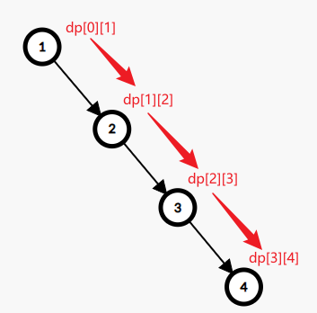

### PS：如果您只需要Bellman-Ford/SPFA/判负环模板，请到相应的模板部分

[上一篇](https://www.cnblogs.com/HankYu/p/16557165.html)中简单讲解了用于多源最短路的**Floyd**算法。本篇要介绍的则是用于**单源最短路**的**Bellman-Ford**算法和它的一些优化（~~已死的~~**SPFA**）

### Bellman-Ford算法

其实，和Floyd算法类似，Bellman-Ford算法同样是基于DP思想的，而且也是在不断的进行**松弛**操作（可以理解为「不断放宽对结果的要求」，比如在Floyd中就体现为不断第一维$k$，具体解释在[这里](https://www.cnblogs.com/HankYu/p/16557165.html))

既然是单源最短路径问题，我们就不再需要在DP状态中指定起始点。于是，我们可以设计出这样的DP状态（和Floyd很类似）：

$$dp[k][u]表示从s（起点）到u，最多经过k条边时的最短路径$$

显然，初始值为：

$$对于起点s，dp[0][s]=0；对于其他任意节点u，dp[0][u]=+\infin$$

我们可以先考虑，如何从$dp[0][u]$转移出$dp[1][u]$（就是多一条边）。

于是很容易想到这个最显而易见~~又最暴力~~的方法：枚举每一条边$(u, v)$，并更新$dp[1][v]=min(dp[1][v], dp[0][u]+w[u][v])（其中w[u][v]表示这条边的边权）$

推广到任意$dp[k-1][u]$到$dp[k][u]$的转移，我们仍然可以使用这样的方法。

下面是代码实现：

```cpp
struct Edge {
	int u, v; // 边的两个端点
	int w; // 边的权值
};

int n; // 点数
int m; // 边数
Edge e[MAXM]; // 所有的边
int dp[MAXN][MAXN]; // 解释见上方

void bellman_ford(int start) {
	memset(dp, 0x3f, sizeof(dp)); // 初始化为INF
	dp[0][start] = 0;
	for(int i = 1; i < n; i++) { // 一张图中的最长路径最多只包含n - 1边，所以更新n - 1遍就够了（因为点不能重复）
		for(int j = 1; j <= n; j++) { // 先复制一遍
			dp[i][j] = dp[i - 1][j];
		}
		for(int j = 1; j <= m; j++) { // 枚举每一条边
			dp[i][e[j].v] = min(dp[i][e[j].v], dp[i - 1][e[j].u] + e[j].w);
		}
	}
}
```

显然，时间复杂度为$O(nm)$，空间复杂度也是$O(nm)$，~~代码复杂度为O(1)~~。

我们可以先考虑优化空间复杂度（压缩掉第一维$k$），于是，DP状态变为：

$$dp[u]表示从s（起点）到u的最短路径$$

转移方程为：

$$dp[v]=min(dp[v],dp[u]+w[v])$$

关于状态压缩后的正确性：最有可能令人不理解的部分就是：在同一轮更新中，我们可能会用已经更新完的值再去更新别的值。这就导致，同一论更新中，不同节点被更新到的DP值对应的$k$可能不同。（如果没看懂，就看下面这张图）



但是实际上，我们其实并不关心到底走了几步，而只关心**最短路的边权和**。所以，像这样的“错位更新”并不会引起错误。

于是，我们可以得到新的代码：

```cpp
struct Edge {
	int u, v; // 边的两个端点
	int w; // 边的权值
};

int n; // 点数
int m; // 边数
Edge e[MAXM]; // 所有的边
int dp[MAXN]; // 解释见上方

void bellman_ford(int start) {
	memset(dp, 0x3f, sizeof(dp)); // 初始化为INF
	dp[start] = 0;
	for(int i = 1; i < n; i++) { // 一张图中的最长路径最多只包含n - 1边，所以更新n - 1遍就够了（因为点不能重复）
		for(int j = 1; j <= m; j++) { // 枚举每一条边
			dp[e[j].v] = min(dp[e[j].v], dp[e[j].u] + e[j].w);
		}
	}
}
```

我们可以继续考虑优化时间复杂度。显然，如果在某一轮的更新后，发现并没有任何一个值被更新，那么就意味着：这张图已经不能再被更新了（已经求出$s$到每个点的最短路），那就可以直接`break`了。

所以，优化后的代码如下：

### Bellman-Ford算法模板

```cpp
struct Edge {
	int v; // 边指向的节点
	int w; // 边的权值
};

int n; // 点数
int m; // 边数
vector<Edge> g[MAXN]; // 保存从每个节点发出的边
int dp[MAXN]; // 解释见上方

void bellman_ford(int start) {
	memset(dp, 0x3f, sizeof(dp)); // 初始化为INF
	dp[start] = 0;
	for(int i = 1; i < n; i++) { // 一张图中的最长路径最多只包含n - 1边，所以更新n - 1遍就够了（因为点不能重复）
		bool updated = 0; // 记录是否有节点被更新
		for(int i = 1; i <= n; i++) { // 枚举每一个节点
			if(dp[i] == 0x3f3f3f3f) { // 无法到达的节点
				continue;
			}
			for(Edge &e : g[i]) { // 枚举从这个节点发出的每一条边
				if(dp[i] + e.w < dp[e.v]) {
					dp[e.v] = dp[i] + e.w;
					updated = 1; // 标记有值被更新
				}
			}
		}
		if(!updated) {
			break; // 没有节点被更新，直接退出
		}
	}
}
```

这就是最常见的Bellman-Ford朴素算法了。

同时，也可以看到，本次优化后的代码中将「直接储存所有边」的方式改为了使用「邻接表」。这是因为邻接表在图论算法中更加常用，也使得Bellman-Ford算法可以更容易地和其他算法配合使用。

### SPFA算法

SPFA算法（Shortest Path Faster Algorithm），顾名思义就是一种让Bellman-Ford跑得更快的方法。

在上一部分的最后，我们对于没有更新的情况，直接`break`掉，来优化时间。但是，稍加思考就会发现：有的时候，我们会为了唯一几个被更新过的节点，而再把所有的节点遍历一遍，那么这样就会产生时间的浪费。所以，SPFA本质上就是使用**队列**来解决这样的问题。

下面是SPFA算法的基本步骤：

1. 我们先设置好初始值（和Bellman-Ford一样），再将起点（$s$）加入队列中。

2. 每次从队列中取出一个节点，尝试用它去更新与它相连的节点；如果某个节点的最短距离被更新了，那么将这个节点加入队列。

3. 回到步骤2

于是，很容易写出对应的代码：

### SPFA算法模板

```cpp
struct Edge {
	int v; // 边指向的节点
	int w; // 边的权值
};

int n; // 点数
int m; // 边数
vector<Edge> g[MAXN]; // 保存从每个节点发出的边
int dp[MAXN]; // 定义没有变
queue<int> q; // 储存点用的队列
bool vis[MAXN]; // 记录每个节点当前是否在队列中

void spfa(int start) {
	memset(dp, 0x3f, sizeof(dp)); // 初始化为INF
	dp[start] = 0;
	q.push(start);
	vis[start] = 1; // 标记一下
	while(!q.empty()) {
		int x = q.front(); // 取出一个节点
		q.pop();
		vis[x] = 0; // 清除标记，因为下次还有可能入队
		for(Edge &e : g[x]) { // 枚举从这个节点发出的每一条边
			if(dp[x] + e.w < dp[e.v]) {
				dp[e.v] = dp[x] + e.w;
				if(!vis[e.v]) { // 如果这个节点现在不在队列中
					q.push(e.v); // 那就把它加入队列
					vis[e.v] = 1; // 标记一下
				}
			}
		}
	}
}
```

一道测试用的例题：[P4779 【模板】单源最短路径（标准版）](https://www.luogu.com.cn/problem/P4779)（因为**SPFA已死**，所以会TLE。。。）

### Bellman-Ford & SPFA判断负环

负环，就是边权和为负数的环。负环是最短路算法中一个很重要的问题，因为只要进入一个负环，最短距离就会无限减小。当然，这肯定不是我们希望的，所以接下来就要介绍如何使用**Bellman-Ford**算法或**SPFA**算法来判断一张图中是否包含负环。

显然，一张有向图上的任意一条简单路径最多只包含$n-1$条边（否则不可能是 *简单* 的）。而且，当图中没有负环时，两点间的最短路径一定是**简单路径**。所以，如果发现从起点到某个节点$u$的最短路径包含**多于$n-1$条边**，那么这条路径上一定包含负环。

所以，我们只需要在算法中添加一些简单的判断就可以实现**判负环**了。

具体方法：

1. 对于普通的Bellman_ford算法，我们可以在完成DP后，在进行一遍更新，如果存在任意节点与起点之间的最短路径是可以被更新的，那么可以确定图中一定存在**负环**

2. 对于SPFA算法，我们可以在更新最短路径的同时，记录每条最短路径上的边数，如果发现某条最短路径的边数大于$n-1$，那么可以确定图中一定存在**负环**

于是，我们可以写出分别使用这两种算法来判负环的代码：

### Bellman-Ford判负环模板

```cpp
struct Edge {
	int v; // 边指向的节点
	int w; // 边的权值
};

int n; // 点数
int m; // 边数
vector<Edge> g[MAXN]; // 保存从每个节点发出的边
int dp[MAXN];

bool bellman_ford_check_ncycle(int start) {
	memset(dp, 0x3f, sizeof(dp)); // 初始化为INF
	dp[start] = 0;
	for(int i = 1; i < n; i++) { // 一张图中的最长路径最多只包含n - 1边，所以更新n - 1遍就够了（因为点不能重复）
		bool updated = 0; // 记录是否有节点被更新
		for(int i = 1; i <= n; i++) { // 枚举每一个节点
			if(dp[i] == 0x3f3f3f3f) { // 无法到达的节点
				continue;
			}
			for(Edge &e : g[i]) { // 枚举从这个节点发出的每一条边
				if(dp[i] + e.w < dp[e.v]) {
					dp[e.v] = dp[i] + e.w;
					updated = 1; // 标记有值被更新
				}
			}
		}
		if(!updated) {
			return 0; // 没有节点被更新，一定没有负环
		}
	}
	for(int i = 1; i <= n; i++) { // 枚举每一个节点
		if(dp[i] == 0x3f3f3f3f) { // 无法到达的节点
			continue;
		}
		for(Edge &e : g[i]) { // 枚举从这个节点发出的每一条边
			if(dp[i] + e.w < dp[e.v]) {
				return 1; // 还能被更新说明有负环
			}
		}
	}
	return 0;
}
```

### SPFA判负环模板

```cpp
struct Edge {
	int v; // 边指向的节点
	int w; // 边的权值
};

int n; // 点数
int m; // 边数
vector<Edge> g[MAXN]; // 保存从每个节点发出的边
int dp[MAXN]; // dp的定义没有变
int cnt[MAXN]; // 记录从起点到节点u的最短路径中的边数
queue<int> q; // 储存点用的队列
bool vis[MAXN]; // 记录每个节点当前是否在队列中

bool spfa_check_ncycle(int start) { // SPFA判负环
	memset(dp, 0x3f, sizeof(dp)); // 初始化为INF
	dp[start] = 0;
	q.push(start);
	vis[start] = 1; // 标记一下
	while(!q.empty()) {
		int x = q.front(); // 取出一个节点
		q.pop();
		vis[x] = 0; // 清除标记，因为下次还有可能入队
		for(Edge &e : g[x]) { // 枚举从这个节点发出的每一条边
			if(dp[x] + e.w < dp[e.v]) {
				dp[e.v] = dp[x] + e.w;
				cnt[e.v] = cnt[e.v] + 1; // 多了当前这条边
				if(cnt[e.v] >= n) { // 从起点到v的最短路径上有多于n - 1条边
					return 1; // 一定出现了负环
				}
				if(!vis[e.v]) { // 如果这个节点现在不在队列中
					q.push(e.v); // 那就把它加入队列
					vis[e.v] = 1; // 标记一下
				}
			}
		}
	}
	return 0; // 没有负环
}
```

一道测试用的例题：[P3385 【模板】负环](https://www.luogu.com.cn/problem/P3385)
