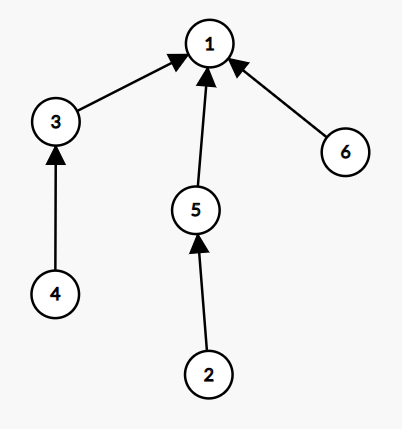

## 分析

我们不妨把这些座位看作是一张图中的节点，把每个人的诉求作为一条边（由【原座位】指向【想去的座位】）

比如，对于样例#1，我们就可以得到这样一张图：


显然，我们有可能会得到多个连通图（比如上面这张）

因为每个座位上的人都只有一个想去的座位，所以每个点的出度就是 $0$（可能只有其他的点指向它） 或 $1$，整每个连通图的边数就是 $n$ （点的个数）或者 $n - 1$ 个

当边数等于 $n$ 时，显然这是一个**环**或者一棵**基环树**（定义见[这里](https://blog.csdn.net/weixin_45697774/article/details/108948457)）

我们以这组数据举例：


```
7
1 2
2 4
3 2
4 1
5 3
6 3
7 6
```

~~手画一下~~复制到[Graph Editor](https://csacademy.com/app/graph_editor/)，可以得到这张图：


试着移动每一个点，容易发现：移动r任意环外点（比如这里的 $3$、$5$、$6$、$7$），环上的点肯定就没位置了。 

**证明（~~废话~~）** ：点 $2$ 唯一的一条出边已经用在环上了，所以 $2$ 和任意环外点之间的边一定是指向 $2$ 的，以此类推，我们可以发现：$3$、$5$、$6$、$7$ 对应的边都是指向 $2$ 的。于是，只要移动必定会移到 $2$ 的位置

于是我们就可以得到结论：如果这是一棵基环树或者一个环，那么它的答案为 $2$（环内的点移/不移，两种情况）

当边数等于 $n$ 时，显然这是一棵**树**

我们拿它举例：



每个节点的出度都为 $1$ 或 $0$（只可能有一个点出度为 $0$，这个座位一开始就空着），所以我们可以将唯一的那个出度为 $0$ 的点（如这张图中的点 $0$）作为树根。

显然，我们移动任意一个点，都会导致一种确定且不重复的情况（它到根节点的链上的每一个点都往上移），所以其答案为 $n$，即点数

于是，最终的答案就是将每个连通图的答案乘起来。

## HowTo

我们现在需要一种方法，可以判环、可以记录每个连通图的大小。

显然，`并查集`很合适。

每输入一个人的要求，我们就把这两个点所在的集合（连通图）合并（merge函数），同时记录集合大小（sz数组）。如果合并前这两个点已经在同一个集合中，那么，这一定是一个环（两点之间有不止一条路径），做一下标记。

最后，统计答案即可。

**你以为结束了？**

还有一个坑。。。

出现自环时，不能向上面那样考虑，因为这一个点移动后还在原来的位置，所以答案是 $1$（最终ans不变）

## 细节请看代码

```cpp
#include <bits/stdc++.h>
using namespace std;

#define int long long // 好习惯：随时开long long

#define MAXN 200005
#define MOD 1000000007 // 记得取模

int n;
int fa[MAXN]; // 并查集 - 父节点
int sz[MAXN]; // 并查集 - 集合大小
bool ish[MAXN]; // is环（记录此集合是否有环）
bool iszh[MAXN]; // is自环

void init(int x) { // 并查集 - 初始化
    for (int i = 1; i <= x; i++) {
        fa[i] = i;
        sz[i] = 1; // 初始大小都是1
    }
}

int find(int x) { // 并查集 - 查找
    if (fa[x] == x) {
        return x;
    } else {
        return fa[x] = find(fa[x]);
    }
}

void merge(int x, int y) { // 并查集 - 合并
    int fx = find(x);
    int fy = find(y);
    if (fx == fy) { // 已经在同一个集合
        return;
    }
    iszh[fy] |= iszh[fx]; // 合并自环信息
    sz[fy] += sz[fx]; // 合并大小
    fa[fx] = fy;
}

signed main() {
    cin >> n;
    init(n * 2); // 初始化
    for (int i = 1; i <= n; i++) {
        int a, b;
        cin >> a >> b;
        if (a == b) {
            iszh[find(a)] = 1; // 标记当前集合含有自环
        }
        if (find(a) == find(b)) { // 已经在同一个集合了
            ish[find(a)] = 1; // 标记当前集合含有环
        }
        merge(a, b); // 连接这两个座位
    }
    int ans = 1;
    for (int i = 1; i <= n * 2; i++) {
        if (find(i) == i) { // i是一个集合的代表
            if (ish[i]) { // 含有环
                if (iszh[i]) { // 自环，答案不变
                    continue;
                }
                ans *= 2;
                ans %= MOD;
            } else { // 不含有环
                ans *= sz[i];
                ans %= MOD;
            }
        }
    }
    cout << ans << endl;
}
```

## AC
