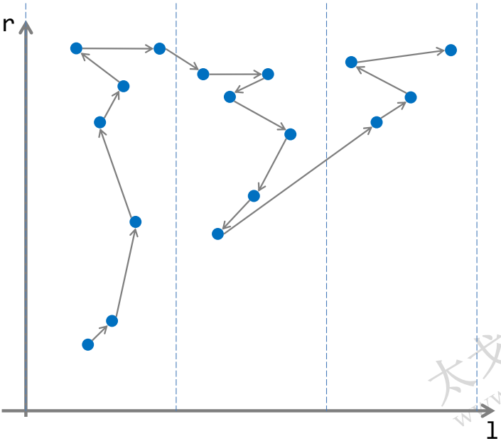

# 概述

## 解决的问题

**无修改**的**离线**区间询问问题

## 对问题的要求

假设 $n$ 为下标范围，$m$ 为询问次数，若从 $[l, r]$ 的答案能够以某种方式（假设一次转移的复杂度为$\Theta(x)$）扩展到 $[l - 1, r], [l + 1, r], [l, r + 1], [l, r - 1]$的答案，那么所有询问可以使用**莫队算法**在 $\Theta((n + m) \sqrt{n} \cdot x)$ 的时间内求出

# 实现

## 简易版本

### 流程

1. 离线后排序（左端点 $l$ 为第一关键字，右端点 $r$ 为第二关键字）
2. 设置初始位置：$l = 1, r = 0, now = 0 (now为当前答案)$
3. 顺序处理每个询问

### 代码

**注：**此代码以**统计区间不同数字个数**为例

```cpp
struct Query {
    int l, r;
    int id, ans;
};

int n, m;
int a[MAXN];
Query q[MAXQ];
int cnt[MAXN];
int l, r, ans;

bool cmpRG(const Query &_a, const Query &_b) { // 左端点为第一关键字，右端点为第二关键字
    if(_a.l != _b.l) {
        return _a.l < _b.l;
    } else {
        return _a.r < _b.r;
    }
}

bool cmpID(const Query &_a, const Query &_b) { // id
    return _a.id < _b.id;
}

void add(int x) { // 向区间添加元素，更新当前答案
    cnt[a[x]]++;
    if(cnt[a[x]] == 1) {
        ans++;
    }
}

void del(int x) { // 从区间删除元素，更新答案
    cnt[a[x]]--;
    if(cnt[a[x]] == 0) {
        ans--;
    }
}

int main() {
    // Code here...
    for(int i = 1; i <= m; i++) {
        cin >> q[i].l >> q[i].r;
        q[i].id = i;
    }
    sort(q + 1, q + m + 1, cmpRG); // 对区间排序
    l = 1; // 初始位置
    r = 0;
    ans = 0;
    for(int i = 1; i <= m; i++) {
        while(r > q[i].r) { // 移动到新区间
            del(r--);
        }
        while(r < q[i].r) {
            add(++r);
        }
        while(l > q[i].l) {
            add(--l);
        }
        while(l < q[i].l) {
            del(l++);
        }
        q[i].ans = ans;
    }
    sort(q + 1, q + m + 1, cmpID); // 恢复原顺序
    // Code here...
}
```

## 优化

### 过程

可以发现，在最劣的情况下，比如询问的区间为 $[1, 1], [1, 50], [1, 100], [2, 2], [2, 50], [2, 100], [3, 3], [3, 50], [3, 100]$ 时，左端点只会移动 $3$ 次，但是右端点会移动大约 $300$ 次

但是，如果对其按如下方式排序，移动次数就会大大降低

$$
[1, 1], [2, 2], [3, 3], [1, 50], [2, 50], [3, 50], [1, 100], [2, 100], [3, 100]
$$

此时左端点大约会移动 $10$ 次，而右端点则会移动 $100$ 次

这只是一个极端情况，对于普遍的情况，莫涛大神则提出了一种基于分块的方法：

1. 将下标范围 $[1, n]$ 分为 $\sqrt{n}$ 块（$[1, \sqrt{n}], [\sqrt{n} + 1, 2\sqrt{n}] \dots$）
2. 以**区间左端点所在的块的编号**为第一关键字，以**右端点**为第二关键字对所有询问区间排序
3. 设置初始位置并顺序处理每个询问（同上）

这样，对于每一个块中的询问（此处**询问所在的块**即指**询问左端点所在的块**），右端点的移动范围都是 $n$（因为同一块内询问右端点有序，最多只会从下标 $1$ 移到下标 $n$），所以右端点移动的总复杂度为 $\Theta(n\sqrt{n})$（总共有 $\sqrt{n}$ 个块）；而对于左端点，如果在块内移动，那么范围就是 $\sqrt{n}$，如果在块间移动，那么范围至多也不超过 $\Theta(2\sqrt{n})$（移动到下一个区间），所以左端点移动的总复杂度为 $\Theta(m\sqrt{n})$（每次移动都是 $\Theta{\sqrt{n}}$）

所以，算法总复杂度为 $\Theta((n + m) \sqrt{n})$，如果算上每次移动的复杂度为 $\Theta(x)$，则总复杂度为 $\Theta((n + m) \sqrt{n} \cdot x)$

### 代码

```cpp
struct Query {
    int l, r;
    int id, ans;
};

int n, m;
int a[MAXN];
Query q[MAXQ];
int cnt[MAXN];
int l, r, ans;
int block;

bool cmpRG(const Query &_a, const Query &_b) { // 左端点为第一关键字，右端点为第二关键字
    if(_a.l / block != _b.l / block) {
        return _a.l < _b.l;
    } else {
        return _a.r < _b.r;
    }
}

bool cmpID(const Query &_a, const Query &_b) { // id
    return _a.id < _b.id;
}

void add(int x) { // 向区间添加元素，更新当前答案
    cnt[a[x]]++;
    if(cnt[a[x]] == 1) {
        ans++;
    }
}

void del(int x) { // 从区间删除元素，更新答案
    cnt[a[x]]--;
    if(cnt[a[x]] == 0) {
        ans--;
    }
}

int main() {
    // Code here...
    block = sqrt(n);
    for(int i = 1; i <= m; i++) {
        cin >> q[i].l >> q[i].r;
        q[i].id = i;
    }
    sort(q + 1, q + m + 1, cmpRG); // 对区间排序
    l = 1; // 初始位置
    r = 0;
    ans = 0;
    for(int i = 1; i <= m; i++) {
        while(r > q[i].r) { // 移动到新区间
            del(r--);
        }
        while(r < q[i].r) {
            add(++r);
        }
        while(l > q[i].l) {
            add(--l);
        }
        while(l < q[i].l) {
            del(l++);
        }
        q[i].ans = ans;
    }
    sort(q + 1, q + m + 1, cmpID); // 恢复原顺序
    // Code here...
}
```

## 再优化（蛇形移动）

可以发现，每次从一个块前往下一个块的时候，左端点常常会移动很远，此时，我们可以利用**蛇形移动**来优化。

我们先将左端点和右端点在坐标系中形象地表示出来：



所谓蛇形移动，就是对于奇数块和偶数块在块内采用相反的方向按右端点排序。这样，每次解决完一个块时，我们不必使左端点回到头部，所以可以节省部分时间。

当然，这种方法通常是常数级优化。

### 具体实现

```cpp
struct Query {
    int l, r;
    int lid; // 左端点所在的块的编号
    int id, ans;
};

int n, m;
int a[MAXN];
Query q[MAXQ];
int cnt[MAXN];
int l, r, ans;
int block;

bool cmpRG(const Query &_a, const Query &_b) { // 左端点为第一关键字，右端点为第二关键字
    if(_a.lid != _b.lid) {
        return _a.lid < _b.lid;
    } else {
        if(_a.lid % 2) { // 奇数块
            return _a.r < _b.r; // 升序排列
        } else { // 偶数块
            return _a.r > _b.r; // 降序排列
        }
    }
}

bool cmpID(const Query &_a, const Query &_b) { // id
    return _a.id < _b.id;
}

void add(int x) { // 向区间添加元素，更新当前答案
    cnt[a[x]]++;
    if(cnt[a[x]] == 1) {
        ans++;
    }
}

void del(int x) { // 从区间删除元素，更新答案
    cnt[a[x]]--;
    if(cnt[a[x]] == 0) {
        ans--;
    }
}

int main() {
    // Code here...
    block = sqrt(n);
    for(int i = 1; i <= m; i++) {
        cin >> q[i].l >> q[i].r;
        q[i].lid = q[i].l / block;
        q[i].id = i;
    }
    sort(q + 1, q + m + 1, cmpRG); // 对区间排序
    l = 1; // 初始位置
    r = 0;
    ans = 0;
    for(int i = 1; i <= m; i++) {
        while(r > q[i].r) { // 移动到新区间
            del(r--);
        }
        while(r < q[i].r) {
            add(++r);
        }
        while(l > q[i].l) {
            add(--l);
        }
        while(l < q[i].l) {
            del(l++);
        }
        q[i].ans = ans;
    }
    sort(q + 1, q + m + 1, cmpID); // 恢复原顺序
    // Code here...
}
```