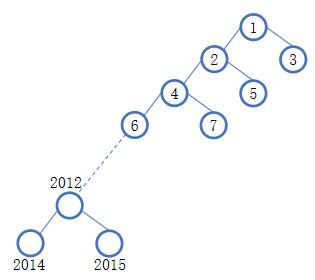

### 1. 叶结点数最大

每个右子节点都为叶节点

例如 **【2015-NOIP-J-初赛-第22题】**：
> 一棵结点数为 2015 的二叉树最多有___个叶子结点。

极端情况下，在二叉树中所有的右节点都是叶子节点，除最下层外的左节点都是父节点且有两个孩子，如图所示，1008 = 1007（3~2015的奇数个数)+1(2014)。

### 1. 叶结点数最小

挂成一条链，则只有一个叶节点

例如 **【2016-NOIP-J-初赛-第22题】**：
> 约定二叉树的根节点高度为 1。一棵结点数为 2016 的二叉树最少有\_\_\_\_\_\_个叶子结点

形成一条链的情况，答案为1
