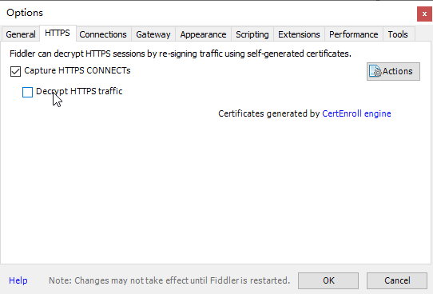
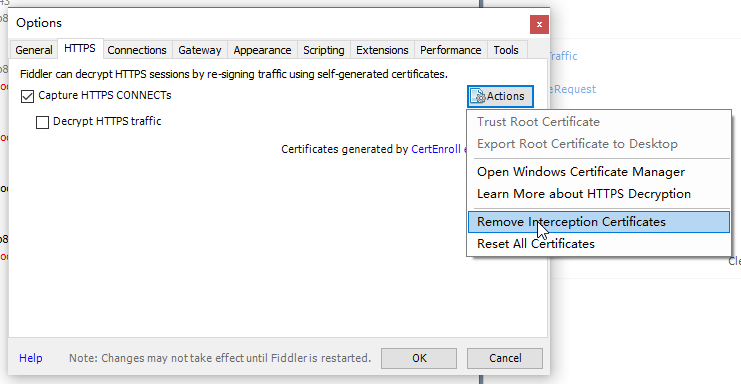
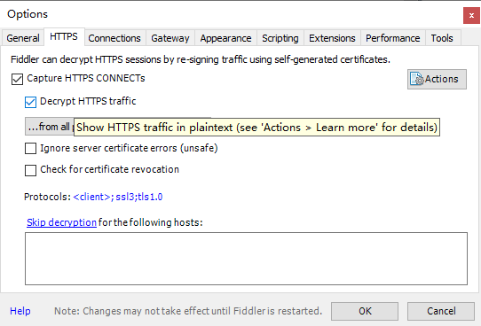

**解决方法：**

1. 打开`fiddler`-`tools`-`options`-`https`

2. 取消勾选`decrypt https traffic`

   

3. 点击`actions-remove interception certficates` ，删除所有证书

   

4. 重新勾选`decrypt https traffic`，根据提示安装证书

   
