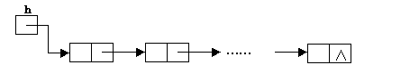

链表是一种物理存储单元上非连续、非顺序的存储结构。链表由一系列结点（链表中每一个元素称为结点）组成，每个结点包括两个部分：一个是存储数据元素的数据域，另一个是存储下一个结点地址的指针域。 

**优点：** 使用链表结构不需要预先知道数据大小，可以充分利用计算机内存空间，实现灵活的内存动态管理，链表还允许插入和移除表上任意位置上的节点。

**缺点：** 链表失去了数组随机读取的优点，同时链表由于增加了结点的指针域，空间开销比较大。

**分类：** 单向链表，双向链表以及循环链表

**图示：** 


以下是一道例题

### UVa11988：悲剧文本

#### 题目

You’re typing a long text with a broken keyboard. Well it’s not so badly broken. The only problem with the keyboard is that sometimes the “home” key or the “end” key gets automatically pressed (internally).
You’re not aware of this issue, since you’re focusing on the text and did not even turn on the monitor! After you finished typing, you can see a text on the screen (if you turn on the monitor).
In Chinese, we can call it Beiju. Your task is to find the Beiju text.
**Input**
There are several test cases. Each test case is a single line containing at least one and at most 100,000 letters, underscores and two special characters ‘[’ and ‘]’. ‘[’ means the “Home” key is pressed internally, and ‘]’ means the “End” key is pressed internally. The input is terminated by end-of-file (EOF). The size of input file does not exceed 5MB.
**Output**
For each case, print the Beiju text on the screen.

#### 翻译

你在用坏了的键盘打一个长文本。嗯，它没那么坏。键盘的唯一问题是，有时会自动按下“home”键或“end”键。

你没有意识到这个问题，因为你专注于文本，甚至没有打开显示器！输入完毕后，您可以在屏幕上看到文本（如果您打开显示器）。

在中文里，我们可以叫它悲剧。你的任务是找到这段悲剧文本。

**输入**

有几组测试数据。每个测试用例是一行，包含至少一个且最多100000个字母、下划线和两个特殊字符“[”和“]”。“[”表示内部按下“Home”键，“]”表示内部按下“End”键。输入在文件末尾（EOF）终止。输入文件的大小不超过5MB。

**输出**

对于每组数据，在屏幕上打印悲剧文本。

#### 分析

用一个next数组表示每一个字符的下一项，比如第一个字符s[1]的下一个是s[2]，则next[1]=2。为了方便起见，我们还可以在链表的第一个元素前放一个虚拟节点，从第一个下标开始储存数据。

我们可以设置一个光标cur，代表着位置i的字符应该插入在cur的右侧。程序运行时，cur有时会跳至左端即cur=0；有时要回到右端，所以还需要开一个last变量保存最右端的下标，使cur能通过cur=last跳回右端。

#### 参考程序

```cpp
#include <cstdio>
#include <cstring>
using namespace std;

const int maxn = 100000 + 5;
int last, cur;
char s[maxn];
int next[maxn];

int main() {
    while(scanf("%s", s + 1) == 1) { //输入
        int n = strlen(s + 1);
        last = 0;
        cur = 0;
        next[0] = 0;
        for(int i = 1; i <= n; i++) {
            char c = s[i];
            if(c == '[') {
                cur = 0;
            } else if(c == ']') {
                cur = last;
            } else {
                //插入c
                next[i] = next[cur];
                next[cur] = i;
                if(cur == last) {
                    last = i; //更新最后字符的编号
                }
                cur = i; //移动光标
            }
        }
        for(int i = next[0]; i != 0; i = next[i]) {
            printf("%c", s[i]);
        }
        printf("\n");
    }
    return 0;
}
```
